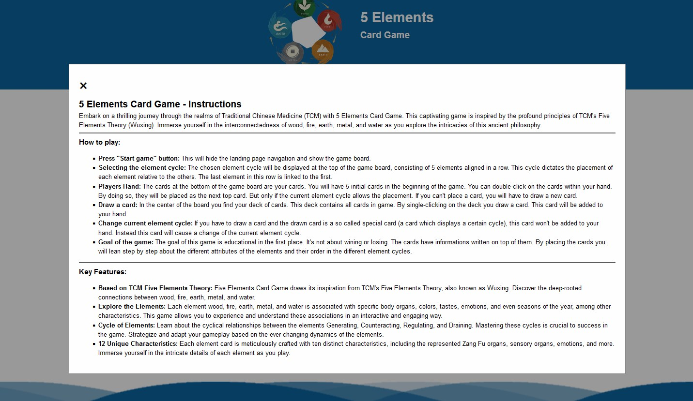
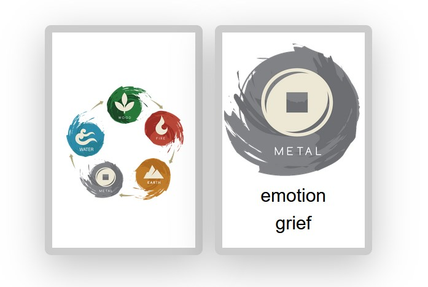

# 5-Elements-Card-Game
The "5 Elements Card Game" is designed for individuals keen on delving into the realm of ancient traditional Chinese medicine (TCM), focusing on the teachings of the 5 elements. Through engaging gameplay, the player will gain insights into the various elemental cycles and understand how these elements influence one another. 5 Elements Card Game is a fully responsive javascript webapplication with the primary goal of education.

The website is live at [https://pbrdys.github.io/5-Elements-Card-Game/](https://pbrdys.github.io/5-Elements-Card-Game/)

## Features
This section describes the different parts of the 5 Elements Card Game site. 

### Existing Features
- __Favicon__
    - This feature enhances brand recognition and user experience by providing a distinctive visual identity in browser tabs and bookmarks, making it easier for users to locate and return to the site.
    

- __5 Elements Card Game Logo and Heading__
    - This section features an logo image that serves as an eye-catcher to capture the user's attention, accompanied by a meaningful headline that informs the user of their location and what to expect on this page. 
    

- __Game Navigation__
    - This section provides an intuitive navigation, designed for user ease. Clear labels, aesthetically pleasing and responsibe design ensure a seamless experience across devices. 
    

- __Game Navigation: Start Game__
    - This feature hides the game navigation presented on the landing page and reveals the actual game area.

- __Game Navigation: About / Rules__
    - This feature activates a module window, enabling users to access information about the game's key features and proper gameplay instructions. It enhances the game's usability, providing clarity on how to use and navigate through its functionalities.
    

- __Landing Page__
    - Its purpose is like a welcomeing page, where the user can start the game, see the rules and how the game is to be played and adjust some settings:
    

- __Footer__
    - This feature offers additional information of the page developer.
    - The wave animation is designed to evoke a sense of comfort and tranquility, encouraging longer page visits and enhancing the overall enjoyment of playing the 5 Elements Card Game.
    

- __Board Information__
    - In this section, users can access both general information and intuitive navigation for the current game. Your name is prominently displayed on the board, and the straightforward menu buttons make it easy to conclude or restart the game, ensuring a seamless and user-friendly experience.
    

- __Current Element Cycle__
    - This section presents the current elemental cycle, consisting of four distinct cycles: regulate, counteract, generate, and drain. Each cycle specifies the sequence in which elements should be arranged. The visual representation, aided by images, provides a helpful overview of how the elements interact. Even though the elements have been arranged in a line for representation, it is a circular cycle, meaning that the last element of the line needs to be connected with the first element again.
    

- __Gameplay Response__
    - This section provides the user with essential information about the game. Employing a color change, it draws the user's attention to highlight ongoing events, such as alterations in the current element cycle or instances where a player is about to place an incorrect card.
     

- __Game Area__
    - This section showcases the entire deck of cards along with the current top card in play. Users have the option to single click on the deck to draw a new card into their hand. By clicking on the deck, the new drawn card will appear in the players hand down below. The card on the right, symbolizing the top card, indicates an element, prompting the user to strategically place a card from their hand on top based on the current element cycle. If the user is unable to make a valid placement, they must draw a card.
    

- __Players Hand__
    - This section presents the user's current hand of cards. The user can strategically place a card from their hand onto the top card in the game area by double-clicking on the chosen card. A successful placement results in the card disappearing from the user's hand and becoming the new top card. In case of an incorrect placement, a message is displayed in the gameplay response section. To ensure visibility of all cards across devices, this section can be scrolled horizontally. On a computer, you can use the scroll bar at the bottom or hold the shift key while scrolling with the mouse wheel. On mobile devices, you can utilize the swipe left or right functionality for easy navigation.
    

- __Card__
    - The Card itself is displaying 3 general informations for the user: the element itself, the category and the specific character. This informations will help him step by step to learn about the nature of the 5 elements.

    

### Future Features
The following features are not available in this release, but will be implemented in the future. 
    - __Multiplayer Mode__
    The primary objective is to offer a educational tool for individual users. To enhance gameplay with greater enjoyment, engagement, and excitement, leading to improved learning outcomes, the next feature to be implemented is the multiplayer mode. This mode allows a minimum of two players to engage in interactive gameplay, strategically placing and drawing cards against each other.
    - __Advanced Gameplay Response__
    The user should get more detailed information while playing this game, which will allow him to deepen the 5 elements knowledge and learn more about the theory of the 5 elements. For example when the user is playing the generating sequence and he is placing earth on top of a fire element, we could provide informations like: 'The earth (the plants within the earth) need heat/fire/the sun in order to grow food. Meaning FIRE generates EARTH!'

## Test
Before deploying this site, it's essential to thoroughly test it to ensure that everything is functioning as expected. 
Following tests have been run:

### 1. Open in Local Browser
To start testing this site, open it in your local web browser. 
Ensure that this website is accessible via internet. 
| Description                                   | Action                                                                   | Expected Result                              | Pass/Fail |
| --------------------------------------------- | ------------------------------------------------------------------------ | -------------------------------------------- | --------- |
| Test: The site is accessible via the internet | type in url(https://pbrdys.github.io/5-Elements-Card-Game/) in any browser | Site is opening and displayed in the browser | Pass      |

### 2. Cross-Browser Compatibility
Test this site in multiple web browsers to ensure it works consistently accross different platforms.
| Description                      | Action                                                      | Expected Result                              | Pass/Fail |
| -------------------------------- | ----------------------------------------------------------- | -------------------------------------------- | --------- |
| Test: Open site in Firefox       | type in [url](https://pbrdys.github.io/5-Elements-Card-Game/) | Site is opening and displayed in the browser | Pass      |
| Test: Open site in Google Chrome | type in [url](https://pbrdys.github.io/5-Elements-Card-Game/) | Site is opening and displayed in the browser | Pass      |
| Test: Open site in Edge          | type in [url](https://pbrdys.github.io/5-Elements-Card-Game/) | Site is opening and displayed in the browser | Pass      |
| Test: Open site in Safari        | type in [url](https://pbrdys.github.io/5-Elements-Card-Game/) | Site is opening and displayed in the browser | Pass      |

### 3. Responsivity Testing
With the increasing use of mobile devices, it's crucial to test your site's compatibility with various devices and screen sizes. This tests cover mobile phones, tablets and bigger screen sizes. 
Dev Tools were used for testing. To open the Developer Tools, just click F12 in your browser. 

| Description                                                                                         | Action                                      | Expected Result                                                                                                                                             | Pass / Fail |
| --------------------------------------------------------------------------------------------------- | ------------------------------------------- | ----------------------------------------------------------------------------------------------------------------------------------------------------------- | ----------- |
| Test: Images on all pages are displayed correctly and are not pixeled or stretched.                 | Change dimension: 250px, 610px and > 1100px | ALL Images on all pages are displayed properly, clear and visible                                                                                           | Pass        |
| Test: All pages are responsive.  overpal, front-size is displayed proportionaly to the screen size. | Change dimension: 250px, 610px and > 1100px | All sections should shrink and grow with the screen size, margins and paddings should be harmonious on all different screen sizes, text should wrap and not | Pass        |

### 4. Functionality Testing
Test all interactive elements on this site such as: 
- Game Navigation: Start Game, About / Rules, End Game, Restart Game, Determine and display element cycle, Shuffle deck, Draw Card, Set Card

| Description                       | Action                                                                                                                                          | Expected Result                                                                                                                                                                                      | Pass / Fail |
| --------------------------------- | ----------------------------------------------------------------------------------------------------------------------------------------------- | ---------------------------------------------------------------------------------------------------------------------------------------------------------------------------------------------------- | ----------- |
| Start the game                    | Click Start Game button                                                                                                                         | Game navigation disapears, game board appears and shows all nessecary elements for the game                                                                                                          | Pass        |
| Read about the game and its rules | Click About / Rules button                                                                                                                      | Module window opens and displays all nessecary information to the user. Window can be closed again                                                                                                   | Pass        |
| End the game                      | Click End button                                                                                                                                | Game board disapears and the game navigation will be displayed again                                                                                                                                 | Pass        |
| Restart the game                  | Click Restart button                                                                                                                            | All elements on the game board will be reloaded and set with new values                                                                                                                              | Pass        |
| Determin element cycle            | Using Browser Tools to determin the current set element cycle, check if the card was removed from the deck and if the displayed html is correct | Element cycle determiend randomly, always new, card should be removed from the global deck and the elements are being displayed properly                                                             | Pass        |
| Determin first top card           | Start or restart the game                                                                                                                       | Only element cards can be set as top card, if a cycle card is drawn the top card has to be determined again                                                                                          | Pass        |
| Draw card                         | Click on the deck                                                                                                                               | A new card should appear in the players hand and a card should be removed from the global deck                                                                                                       | Pass        |
| Set card                          | Double-Click on a card in the players hand                                                                                                      | The clicked card should appear as top card and is removed from players hand                                                                                                                          | Pass        |
| Check if "set card" is valid      | Double-Click on a card in the players hand                                                                                                      | If the card is valid due to the current element cycle it should appear as top card. If the card is not valid due to the current element cycle a additional message should be displayed for the user. | Pass        |
| Display additional messages       | Draw cards until you draw a cycle card                                                                                                          | Message should occure, change background from yellow to green and then back to yellow.                                                                                                               | Pass        |
| Display additional messages       | Set card that is not valid                                                                                                                      | Message should occure, change background from yellow to green and then back to yellow.                                                                                                               | Pass        |
| Shuffle the deck                  | Using Browser Tools to check the global deck variable before and after calling the shuffleDeck() function                                       | Elements should be arranged in a random order                                                                                                                                                        | Pass        |

### 5. Contrast Testing
The colors on this site were chosen to harmonize with each other. 
Colors used: 
- Primary: #0C65A0; (light blue)
- Secondary: #1c5981; (dark blue)
- Accent: #f4b160; (orange)

WAVE Web Accessibility Evaluation Tool was used to assess the accessibility of web pages and identify potential issues or barriers for people with disabilities.
| Description                                                             | Action                         | Expexted Result                                                      | Pass/Fail |
| ----------------------------------------------------------------------- | ------------------------------ | -------------------------------------------------------------------- | --------- |
| Test: Every page contains an h1 tag                                     | Open every page and run "WAVE" | Every page contains exactly one h1 tag                               | Pass      |
| Test: Every page has a correct heading hirarchy, no heading was skipped | Open every page and run "WAVE" | Every page has the right heading hirarchy.               | Pass      |
| Test: Every image has an alt-text                                       | Open every page and run "WAVE" | Every image has an meaningful alt-text                               | Pass      |
| Test: Contrast of all page elements matches the accessibility criteria  | Open every page and run "WAVE" | Every part of the page meets the contrast criteria for accessibility | Pass      |

### 6. Validator Testing 
- HTML
  - No errors were returned when passing through the official W3C validator.
  - Test run for all pages: index.html, training.html, price.html, thank-you.html, contact.html, 404.html
  
- CSS
  - No errors were found when passing through the official (Jigsaw) validator.
  
- JS
    - No errors were found when passing through the (Jshint) validator.
    

## Bugs 
| Bug description                                                                      | When / How does it appear? | Expected behaviour                        | Solution |
| ------------------------------------------------------------------------------------ | -------------------------- | ----------------------------------------- | -------- |
| Bug: Sometimes only 4 initial cards for the players hand will be loaded instead of 5 | When starting a new game   | Player should have always 5 initial cards | None yet |

## Deployment
After this site has been tested successfully and it passed all those tests, it's time to deploy this site to a live server
or hosting environment. 
Here's a step-by-step guide on how to deploy this site:

### 1. Version Control (GitHub)
All files has been commited during the development process to GitHub.
    File Structure: 
        - HTML Files (all used pages)
        - assets/img (all used images for the site)
        - assets/js (javascript used for this site)
        -doc (all images used for this documentation)

### 2. Git Commands used during the development
    - git add .                                     |       Add all changes to the next commit
    - git commit -m "commit message here"           |       Commit the added changes
    - git push                                      |       Finally push the changes to the git repository

### 3. Deploy site
I deployed the site using GitHub Pages. The steps were:
- On the GitHub page for this project, go to the 'Settings' menu
- Go to 'Pages'
- Under 'Build and deployment > Branch', select 'main'
- Click 'Save'
- From now on the site will be accessible at a URL like `https://pbrdys.github.io/5-Elements-Card-Game/`.

#### Cloning
Navigate to the GitHub Repository you want to clone to use locally:
In this case: `https://github.com/pbrdys/5-Elements-Card-Game/`
- Click on the code drop down button
- Click on HTTPS
- Copy the repository link to the clipboard
- Open your IDE of choice (git must be installed for the next steps)
- Type git clone copied-git-url into the IDE terminal
The project will now have been cloned on your local machine for use.

#### How to install git on your computer:
We are using Windows, so the documentation provided here is specific to Windows. If you are using macOS or Linux, you can easily find installation instructions for Git by performing a web search.

Git for Windows (Git Bash):
- Go to the official Git website for Windows: https://gitforwindows.org/
- Download the latest version of Git for Windows.
- Run the installer and follow the installation wizard's instructions.
- During the installation, you can select various options. The default options are usually fine for most users.

## Credits

### Media
- All images used in this website are made, designed, created by me
- All written information are based on my knowledge with tcm 5 elements

#### Reference documents used: 
- CodeInstitute HTML and CSS course material
- CodeInstitute 'Love Maths' walkthrough project guidance 
- [Mozilla Developer Network](https://developer.mozilla.org/en-US/) documentation on HTML and CSS